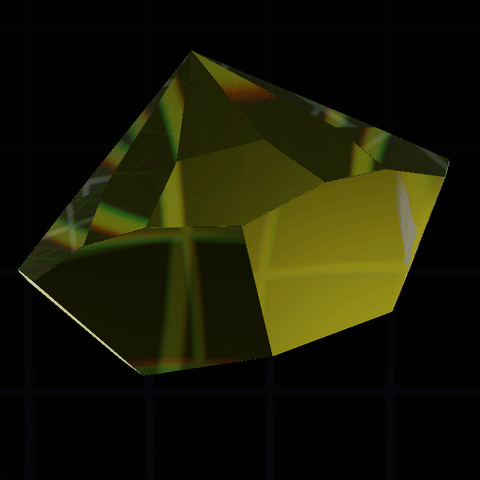
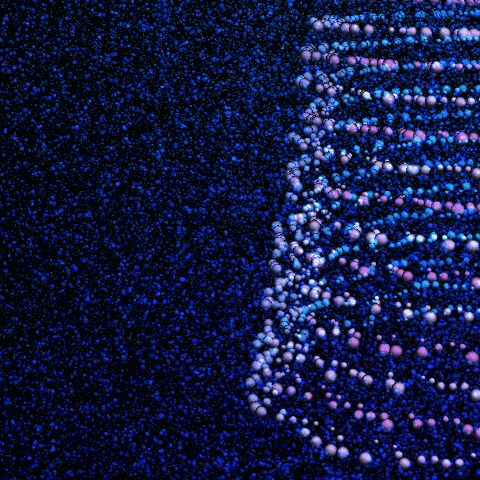

### `pypy3 render-2D.py 5; rm *.rgb`

### `gcc -O3 render-pc.c -o render -lm -pthread; ./render 5 ; rm render; rm *.rgb`  

### `gcc -O3 render-opengl.c -I/opt/homebrew/include -L/opt/homebrew/lib -lglfw -framework OpenGL -o render; ./render; rm render`

### `for f in *.mp4; do ffmpeg -i "$f" "${f%.mp4}.gif"; done`

--- 
### `diamond.c`
- `gcc -O3 diamond.c -o diamond -I/opt/homebrew/include -L/opt/homebrew/lib -lglfw -framework OpenGL -framework Cocoa -framework IOKit -framework CoreVideo -lm`

- `./diamond -cut 0 -carat 2 -clarity 0.01 -g .9 -b .15 -o brilliant_flawless_pissy_yellow_2ct.gif`
  

---

### `render-opengl.py`

---

### `rig/rig.py` & `rig/rig_parser.pl`

- 1:`tpl -l rig_parser.pl -g "write_rigging_program(77), halt."`
- 2: `tpl -l rig_parser.pl -g "validate_script, halt."`
- 3: `python3 rig.py script.rig`

